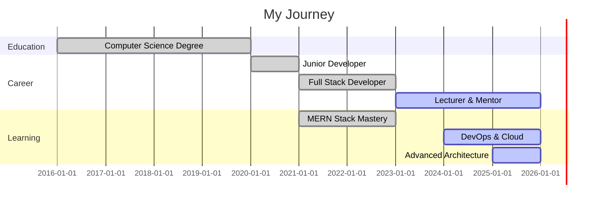

<div align="center">

<!-- Animated Header -->


<!-- Animated Typing -->


<!-- Profile Views & Badges -->
<p align="center">
  
  
  
  
</p>

</div>

<!-- Animated Divider -->


<!-- Animated GIF Section -->
<div align="center">
  
</div>

## 🎯 About Me

```javascript
const james = {
    location: "Nairobi, Kenya 🇰🇪",
    title: "Full Stack Developer & Educator",
    company: "Lecturer & Mentor",
    currentProject: "Assignment Management System (MERN)",
    learning: [
        "Advanced Backend Architecture",
        "DevOps & CI/CD",
        "System Scalability",
        "Cloud Technologies"
    ],
    askMeAbout: [
        "Web Development",
        "MERN Stack",
        "Teaching Programming",
        "Building Educational Platforms"
    ],
    technologies: {
        frontend: {
            js: ["React", "JavaScript ES6+"],
            css: ["CSS3", "Tailwind", "Responsive Design"],
            markup: ["HTML5", "JSX"]
        },
        backend: {
            js: ["Node.js", "Express.js"],
            php: ["PHP", "Core PHP"],
        },
        databases: ["MongoDB", "MySQL"],
        devOps: ["Git", "GitHub", "Docker 🐳"],
        tools: ["VS Code", "Postman", "npm", "Figma"]
    },
    architecture: ["MVC", "REST API", "Microservices"],
    currentFocus: "Building scalable, user-centric applications",
    funFact: "I turn coffee ☕ into code and students into developers! 👨‍🎓"
};
```

<br clear="right"/>

<!-- Animated Divider -->


## 🔥 What I'm Up To

<table>
<tr>
<td width="50%" valign="top">

### 🚧 Current Projects


- 🎓 **Assignment Management System**
  - Built with MERN Stack
  - Real-time updates & notifications
  - Role-based access control
  - File upload & management
  - Analytics dashboard
  
- 🌐 **Portfolio Website**
  - Personal branding
  - Project showcase
  - Blog integration

### 🌱 Learning Journey


- 🔐 **Security**: API Authentication & JWT
- 🧪 **Testing**: Jest, Mocha, TDD
- ☁️ **Cloud**: AWS, Heroku, Digital Ocean
- 🐳 **DevOps**: Docker, CI/CD Pipelines
- 📊 **Monitoring**: Performance Optimization

</td>
<td width="50%" valign="top">

### 🤝 Open for Collaboration


- 💼 Full Stack Web Applications
- 📚 Educational Platforms & E-Learning
- 🛠️ Open Source Projects
- 🎨 Creative Tech Solutions
- 🤖 Automation Tools
- 📱 Progressive Web Apps

### 💬 Ask Me About


- 🌐 JavaScript Ecosystems
- ⚛️ React.js & Component Design
- 🟢 Node.js & Express.js
- 🍃 MongoDB & Database Optimization
- 🎓 Teaching Programming Concepts
- 🏗️ Software Architecture
- 🔧 Debugging & Problem Solving

</td>
</tr>
</table>

<!-- Animated Divider -->


## 🛠️ Tech Arsenal

<div align="center">

### 🎨 Frontend Development

<p>

</p>


### ⚙️ Backend Development

<p>

</p>


### 🗄️ Databases

<p>

</p>


### 🔧 Tools & Technologies

<p>

</p>


</div>

<!-- Animated Divider -->


## 📊 GitHub Analytics

<div align="center">
  
<!-- GitHub Stats Cards -->


<!-- Most Used Languages -->


<!-- Contribution Graph -->


</div>

<!-- 3D Contribution Graph -->
<div align="center">
  
</div>

<!-- Animated Divider -->


<!-- Animated Divider -->


## 🎓 Teaching & Mentoring

<div align="center">


### *"The best way to learn is to teach, and the best way to master is to build."*

</div>

<table>
<tr>
<td width="50%">

### 👨‍🏫 As a Lecturer

- 📖 Simplifying complex programming concepts
- 🎯 Designing hands-on coding exercises
- 💡 Creating real-world project scenarios
- 🔍 Conducting code reviews & feedback sessions
- 📚 Developing curriculum for modern web dev

</td>
<td width="50%">

### 🌟 As a Mentor

- 🚀 Guiding career transitions into tech
- 💼 Preparing students for industry challenges
- 🤝 Building developer communities
- 🎓 Bridging theory and practice gap
- ✨ Inspiring the next generation of coders

</td>
</tr>
</table>

<!-- Animated Divider -->


## 💡 Featured Projects

<div align="center">

<!-- Project Cards with Images -->
<table>
<tr>
<td width="50%">

### 🎓 Assignment Management System


**Tech Stack:** MERN Stack

**Features:**
- ✅ Real-time notifications
- ✅ Role-based access control
- ✅ File upload & management
- ✅ Analytics dashboard
- ✅ Automated grading system

</td>
<td width="50%">

### 📚 Educational Platform


**Tech Stack:** React.js, Node.js, MongoDB

**Features:**
- 🎥 Interactive learning modules
- 👥 Student progress tracking
- 📊 Performance analytics
- 💬 Real-time chat support
- 🏆 Gamification elements

</td>
</tr>
<tr>
<td width="50%">

### 🔧 RESTful API Projects


**Tech Stack:** Express.js, MongoDB

**Features:**
- 🔐 JWT Authentication
- 📡 CRUD Operations
- 🛡️ Data validation
- 📝 API Documentation
- ⚡ Optimized performance

</td>
<td width="50%">

### 🌐 Portfolio Website


**Tech Stack:** React.js, Tailwind CSS

**Features:**
- 🎨 Modern UI/UX design
- 📱 Fully responsive
- ⚡ Fast loading
- 🎯 SEO optimized
- 📧 Contact form integration

</td>
</tr>
</table>

</div>

<!-- Animated Divider -->


## 📈 Coding Activity

<div align="center">

<!-- Productive Time -->


<!-- Language Stats -->


</div>

<!-- Animated Divider -->


## 💼 Work Experience & Education

<div align="center">



</div>

<!-- Animated Divider -->


## 📫 Connect With Me

<div align="center">

 <em><b>I love connecting with different people!</b> Let's collaborate and build something amazing together! 🚀</em>

<br><br>

<!-- Social Media Badges -->
[](mailto:muthiorajames39@gmail.com)
[](https://www.linkedin.com/in/james-muthiora-89915a271/)
[](https://github.com/mbayajames)
[](https://main-project-blue-eight.vercel.app/)

<br>

<!-- Contact Form Suggestion -->
<p>
📧 <b>For business inquiries:</b> muthiorajames39@gmail.com<br>
💼 <b>Open to:</b> Freelance Projects | Collaborations | Speaking Engagements
</p>

</div>

<!-- Animated Divider -->


## 💭 Quote of the Day

<div align="center">


</div>

<!-- Animated Divider -->


<!-- Animated Divider -->


<div align="center">

### ⚡ Fun Facts About Me


- 🎯 **Code Philosophy:** Clean code is better than clever code
- ☕ **Fuel:** Coffee + Music = Productivity
- 🌙 **Best Coding Time:** Late night coding sessions
- 🎮 **Hobbies:** Gaming, Reading Tech Blogs, Teaching
- 🌍 **Dream:** Build tech solutions that impact Africa
- 📚 **Currently Reading:** Clean Code by Robert C. Martin
- 🎓 **Certifications:** Working towards AWS & MongoDB certifications
- 💡 **Belief:** Anyone can code with the right guidance

<br clear="right"/>

---

### 🎯 2026 Goals

- ✅ Complete 100+ GitHub contributions
- 🚀 Launch 3 major projects
- 📚 Mentor 50+ students
- 🏆 Contribute to 10+ open source projects
- 📝 Write 20+ technical blog posts
- ☁️ Get AWS Certified
- 🐳 Master Docker & Kubernetes

</div>

<!-- Animated Divider -->


<div align="center">

### 💖 Support My Work


If you find my projects helpful or interesting, consider:

⭐ **Starring my repositories**  
🔄 **Sharing my work**  
☕ **Buying me a of coffee**  
🤝 **Collaborating on projects**

<a href="https://www.buymeacoffee.com/mbayajames">
  
</a>

</div>

<!-- Animated Divider -->


<div align="center">

### 📝 Latest Blog Posts

<!-- BLOG-POST-LIST:START -->
- 🚀 Building Scalable MERN Applications
- 💡 10 JavaScript Tips Every Developer Should Know
- 🎓 Teaching Programming: Best Practices
- 🔐 Implementing JWT Authentication in Node.js
- 📊 MongoDB Performance Optimization Techniques
<!-- BLOG-POST-LIST:END -->

</div>

<!-- Animated Divider -->


<div align="center">

### 🎨 Random Dev Meme


**⭐ From [mbayajames](https://github.com/mbayajames) with 💙 and ☕**

</div>

<!-- Animated Footer -->

